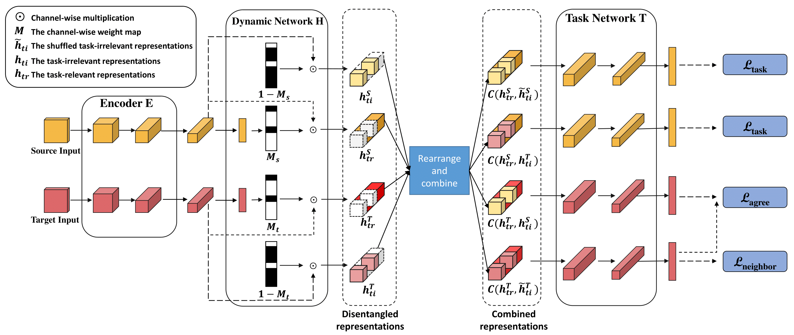

# Disentangling Task-Oriented Representations for Unsupervised Domain Adaptation

This resposity is the official implementation of our TIP2021 [Paper](https://ieeexplore.ieee.org/abstract/document/9662671). 


### Dataset

- Person reID
  - Market1501
  - DukeMTMC-reID
- Vehicle reID
  - VehicleID_V1.0
  - VeRi
- Office31


## Experience

- ReID
  - bash Disentangle.sh
- Office
  - bash office.sh
- Some models have been uploaded to an anonymous google drive:
  * [https://drive.google.com/open?id=1BfSMmd70d405E8X8kA3e-I4Luefr99nl]
  * [https://drive.google.com/open?id=1wUiWbxmTVMsqk7k3omfDm3Nom1kDY5KF]


### Citations
If our paper helps your research, please cite it in your publications:
```
@article{dai2021disentangling,
  title={Disentangling Task-Oriented Representations for Unsupervised Domain Adaptation},
  author={Dai, Pingyang and Chen, Peixian and Wu, Qiong and Hong, Xiaopeng and Ye, Qixiang and Tian, Qi and Lin, Chia-Wen and Ji, Rongrong},
  journal={IEEE Transactions on Image Processing},
  volume={31},
  pages={1012--1026},
  year={2021},
  publisher={IEEE}
}
```
